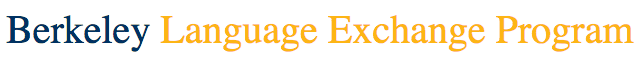

The Berkeley Language Exchange Program
====
[](https://codeclimate.com/github/swchoi727/LEP)
[](https://codeclimate.com/github/swchoi727/LEP)

## Contributing

Dependencies:
- `rvm` (https://rvm.io/)
- Ruby `v1.9.3p551` (run `rvm install 1.9.3` to install)

Run ```cd . && bin/setup``` from the project root to get everything set up.

<!-- ## The Berkeley Language Exchange Program -->


**[The Berkeley Language Exchange Program](http://slc.berkeley.edu/international-student-program)** is a fun & free platform for Cal students from around the globe to meet and share their language skills.


## Screencast
PLACE LINK TO SCREENCAST HERE

<!-- ## License


This work is licensed under a [Creative Commons Attribution 3.0 Unported
License](http://creativecommons.org/licenses/by/3.0/deed.en_US) -->